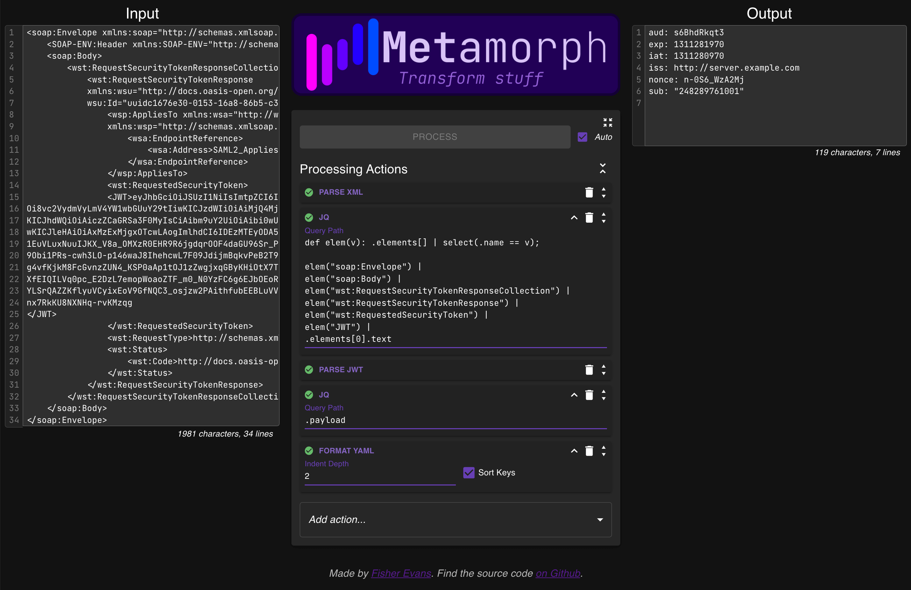

# Metamorph

> Verb: to undergo a complete change of form, structure, or substance, as transformation by magic or witchcraft.

This project is the result of the countless times I've google search "base 64 decoder" and "json formatter" and pasting those outputs into sublime so I could find/replace stuff. And then doing that over and over while I debug issues.

So... I decided to make a little app that lets you configure a string of common transformations - and save them as a bookmark!

#### Play with it here: https://metamorph.fisherevans.com/



## Contributing

### Run it Locally

```bash
npm install # once
npm run start
```

### Add a new Processing Action

- Add a new `ActionCode` enum and any config you need to `src/components/AppConfig/protos/model.proto`

  > *We use ProtoBuf for config in order to minimize the size of the data blob we stuff in the URL*

- Run `npm run codegen`

- Follow the patterns in `src/components/ProcessingActions` (i.e. `regex/Regex.tsx`) to create the new function:

  - A processor that actually transform the data
  - If there's config involved:
    - an "Ensure*Config'er" to establish the default config values
    - a "Configure'er" to allow a user to change the config
    - a "Sumuraize'er" to display a concise version of the current config

- Add a new entry in via `registerAvailableAction(*)` in `src/components/ProcessingActions/ActionSetup.tsx`